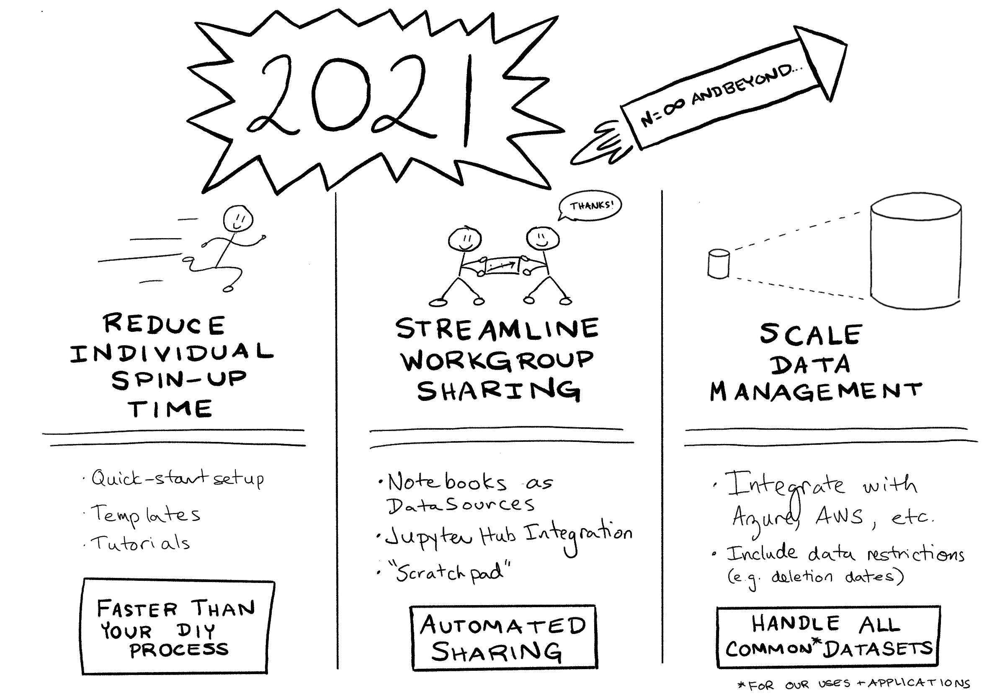

For 6 weeks now, I've been on a parenting sabbatical; that is, I split my 9-month Parental Leave into two parts, separated by a 6-week "return to work". On Monday, my work is done, and I go back on Parental Leave.

It took some serious logistics (a certain pandemic wiped out my original childcare plans), but I think I got some really great work done. Not only did I finish up old work, I feel like I've been able to at least dip my toe into the current research problems, which will make coming back in November all that much easier.

## 6 Weeks in Review

It's been an intense 6 weeks.

Back in February, Amy and I presented our summary of Reproducibility research in 2020. In that talk, we also set out our roadmap for where we want to take the reproducibility project (Easydata) in 2021. My plan for my 6-week return was to get a good start on this roadmap, readying Easydata for the next set of projects and workshops to be thrown at it (later this summer, and early this fall).

In the last 6 weeks, I focused heavily on implementing the "Streamline Workgroup Sharing" improvements outlined in that talk. Particularly:
* Improving the [Catalog] object: Implementing a more git-friendly catalog format
* Implementing **notebook-as-transformer**: i.e. the ability to use notebooks as nodes in the `DatasetGraph`. This allows an analyst to ceate a `Dataset` in a jupyter notebook (complete with all the storytelling that comes along with that format), and have that notebook be used automatically to regenerate the Dataset as part of the usual `Dataset.load()` dependency traversal mechanism (i.e. as a **transformer** in the `DatasetGraph`).

This has set up some good opportunities to use the improved framework both immediately, and in the upcoming months:

* Amy's preparing a set of tutorial notebooks for the [Vectorizers Playground].
* Amy's presenting an [Easydata tutorial], and I'm giving a talk on the [Easydata Makefile workflow] at this year's Pydata Global.
* Easydata will be driving the git repos for a number of upcoming workshops and research events (details to come).

[Vectorizers Playground]: https://github.com/acwooding/vectorizers_playground
[Easydata Tutorial]: https://www.youtube.com/watch?v=KrIRTPvzLHM
[Easydata Makefile Workflow]: https://github.com/hackalog/make_better_defaults/blob/main/README.md

### We released Easydata 2.0

Easydata 2.0 consists of two new features ([new catalog format][catalog] and notebook-as-transformer), and a massive API cleanup. Because we removed almost as much code as we added (+1300 lines, -900 lines) , we cranked the major version number to warn the user that they may want to review the documentation (or at least the blog post) before proceeding.

[catalog]: https://hackalog.github.io/git-friendly-catalog
[api-changes]: https://hackalog.github.io/api-changes

### We reimplemented Catalogs

A `Catalog` object is a serializable, disk-backed git-friendly dict-like object for storing a data catalog.

* **serializable** means anything stored in the catalog must be serializable to/from JSON.
* **disk-backed** means all changes are reflected immediately in the on-disk serialization.
* **git-friendly** means this on-disk format can be easily maintained in a git repo (with minimal
     issues around merge conflicts), and
* **dict-like** means programmatically, it acts like a Python `dict`.

The new Catalog replaces the monlithic "catalog-as-json-files" that were used by Easydata. The main problem with these files is that, when several users were using the same git repo (like say, in a workshop) these catalogs were a rich source of git merge conflicts.

My favourite thing about the new Catalog format is that it's almost completely transparent to the code. Internally, it just acts like a dict. The serialization almost comes for free. Implementing catalogs in this fashion let us remove a whole pile of special-case code for dealing with the various catalogs.

For details, read my [blog post][catalog].

### We implemented Notebook-as-transformer

Internally, Easydata maintains a dependency hypergraph called the `DatasetGraph`. Nodes in this graph are `Dataset` objects. Edges are composable "transformer functions" which take in 0 or more Datasets, and emit 1 or more Datsets. For more details, see my blog post on [transformers and datasets].

[transformers and datasets]: transformers-and-datasets

The DatasetGraph is the magic that lets `Dataset.load()` just magically work. If the Dataset is present on-disk, it's loaded from there. If not, it's generated by walking its dependency list and building (or loading) the relevant Datasets before running a transformer function.

Writing transformer functions was never hard, but it was one place where we spent a bunch of time coaching users. So, to make Easydata easier to use, we've eliminated the need to put everything in a single function. Now a user can specify a *jupyter notebook* as a transformer function. So long as the notebook writes the desired dataset to disk, the process will just magically work.

Allowing *notebook-as-transformer* greatly improves the storytelling possible with Easydata, as `Dataset` preparation (and all the narration that goes along with it) can be stored in the main flow of jupyter notebooks, instead of hidden in a transformer function inside the project's `src` module.

### We made a whole bunch of other API changes
Since we were already breaking a bunch of API with the `Catalog` change, we took the opportunity to clean (or remove) a lot of the more troublesome (or confusing) parts of the Easydata API. These were design decisions which we knew had issues (and for which we had usually developed workarounds), but we were keeping for purposes of backwards compatibility. There were a lot of small changes here (see my [api-changes] blog post for details), but a lot of those changes can be described as follows:

* Names have semantic baggage. **Good** (variable, method, parameter) **names are important**.
* Good API design comes from watching users actually *use* your framework
* Any day you can delete a bunch of code by introducing a new API is a good day.

### And now: Back to Parenting

So that's it for a few months. I'm off on Parental leave until November. @acwooding's still around, however, so feel free to direct your reproducibility questions her way in the meantime.

See you in the fall!